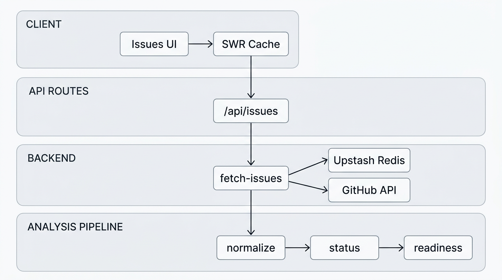

# IssueScout

Find OSS issues that don't appear to have an open PR referencing them. Live at [issue-scout.dev](https://www.issue-scout.dev). Browse issues across multiple ecosystems (TanStack, Vercel, etc.) and filter by status, readiness, and labels.

---

## 1. Prerequisites

- Node.js 18+
- pnpm

---

## 2. Setup

1. **Install dependencies:**

   ```bash
   pnpm install
   ```

2. **Create `.env.local`** with Upstash Redis (required) and optionally a GitHub token for local refresh testing:

   ```
   UPSTASH_REDIS_REST_URL=...
   UPSTASH_REDIS_REST_TOKEN=...
   GITHUB_TOKEN=...   # optional for local; required in production for cron refresh
   CRON_SECRET=...    # optional for local; required in production
   ```

   Data is served from the Upstash cache. A scheduled job (GitHub Actions) refreshes the cache from GitHub every 6 hours. No user token is required. For preview deployments, set `NEXT_PUBLIC_SITE_URL` to your deployment URL so Open Graph and metadata use the correct domain.

3. **Add Upstash Redis** (required):

   - Vercel: [Integrations](https://vercel.com/dashboard) → **Browse Marketplace** → **Upstash** → **Upstash KV** → Install and link to your project
   - Add env vars `UPSTASH_REDIS_REST_URL` and `UPSTASH_REDIS_REST_TOKEN` (from Upstash Console, or map Vercel's `KV_REDIS_REST_*` vars to `UPSTASH_REDIS_REST_*` when connecting)

**Verifying KV cache:**

1. Run `pnpm dev` with `UPSTASH_REDIS_REST_URL` and `UPSTASH_REDIS_REST_TOKEN` in `.env.local`.
2. `curl http://localhost:3000/api/debug/cache` — Expect `redis: "ok"` when configured.
3. To populate the cache locally: `curl -X POST -H "Authorization: Bearer $CRON_SECRET" http://localhost:3000/api/cron/refresh` (requires `GITHUB_TOKEN` and `CRON_SECRET`).
4. [Upstash Console](https://console.upstash.com) → your database → **Data Browser** — After a refresh, you should see keys like `issues:tanstack`, `issues:vercel`.

---

## 3. Scripts

| Script | Description |
|--------|-------------|
| `pnpm dev` | Start the development server |
| `pnpm build` | Build for production |
| `pnpm start` | Start the production server |
| `pnpm lint` | Run ESLint |
| `pnpm typecheck` | Run TypeScript check |
| `pnpm test` | Run tests |
| `pnpm test:watch` | Run tests in watch mode |
| `pnpm test:coverage` | Run tests with coverage |
| `pnpm test:e2e` | Run E2E tests (starts dev server automatically) |
| `pnpm test:e2e:ui` | Run E2E tests with Playwright UI |

---

## 4. API

### GET /api/issues

| Query param | Type | Default | Description |
|-------------|------|---------|-------------|
| `page` | number | 1 | Page number |
| `limit` | number | 50 | Items per page (max 100) |
| `ecosystem` | string | — | Filter by ecosystem (e.g. `tanstack`) |

Returns all ecosystems or a single ecosystem when `ecosystem` is set. Response: `{ issues, summary, pagination }` with `pagination: { page, limit, total, hasMore }`.

### GET /api/issues/[ecosystem]

| Query param | Type | Default | Description |
|-------------|------|---------|-------------|
| `page` | number | 1 | Page number |
| `limit` | number | 50 | Items per page (max 100) |

Returns issues for the specified ecosystem. Valid ecosystem IDs: `tanstack`, `vercel`.

### Error codes

| Status | Meaning |
|--------|---------|
| 400 | Invalid ecosystem |
| 429 | Rate limit exceeded |
| 500 | Server error |
| 503 | Missing configuration (Redis) or cache empty (run refresh workflow) |

---

## 5. Architecture



- **Config:** [src/lib/ecosystems.config.ts](src/lib/ecosystems.config.ts) defines ecosystems and their repos.
- **API:** `GET /api/issues` and `GET /api/issues/[ecosystem]` read from the Upstash cache only. A GitHub Actions workflow runs every 6 hours to refresh the cache via `POST /api/cron/refresh`, which fetches from the GitHub API and writes to Upstash.
- **Analysis:** Raw issues are normalized in [src/lib/analysis/normalize.ts](src/lib/analysis/normalize.ts), which uses [status.ts](src/lib/analysis/status.ts) (likely_unclaimed, possible_wip, stale) and [readiness.ts](src/lib/analysis/readiness.ts) (high/medium/low scoring).
- **Client:** [src/app/issues/page.tsx](src/app/issues/page.tsx) and [src/app/ecosystem/[id]/page.tsx](src/app/ecosystem/[id]/page.tsx) fetch from the API, apply filters from [src/lib/filters.ts](src/lib/filters.ts), and render issue cards. Filters are persisted in the URL.

---

## 6. Adding Ecosystems

Edit [src/lib/ecosystems.config.ts](src/lib/ecosystems.config.ts) to add or modify ecosystems. Each ecosystem has an `id`, `name`, `description`, and list of `repos` (e.g. `"tanstack/query"`).

---

## 7. Deploying to Vercel

1. Connect your repo to Vercel.
2. Set env vars: `GITHUB_TOKEN`, `UPSTASH_REDIS_REST_URL`, `UPSTASH_REDIS_REST_TOKEN`, `CRON_SECRET`. Optionally `NEXT_PUBLIC_SITE_URL` for preview deployments.
3. Add GitHub secret: `CRON_SECRET` (same as Vercel). The refresh workflow reads the site URL from [config/site.json](config/site.json).
4. After first deploy, run the **Refresh cache** workflow manually (Actions → Refresh cache → Run workflow) to populate the cache.
5. The `vercel.json` `ignoreCommand` runs lint, typecheck, and unit tests before deploy. E2E runs in CI only; deploys are gated by CI (including E2E).
6. For production, consider adding error tracking (e.g. Sentry) and monitoring `/api/health` for uptime checks.
7. Rate limiting uses `x-forwarded-for` from the reverse proxy. When deploying to Vercel, the proxy sets this header correctly. If self-hosting, ensure your reverse proxy sets `x-forwarded-for`; otherwise clients could spoof it and bypass rate limits.

---

## 8. Contributing

See [CONTRIBUTING.md](CONTRIBUTING.md) for setup, scripts, and PR process.
